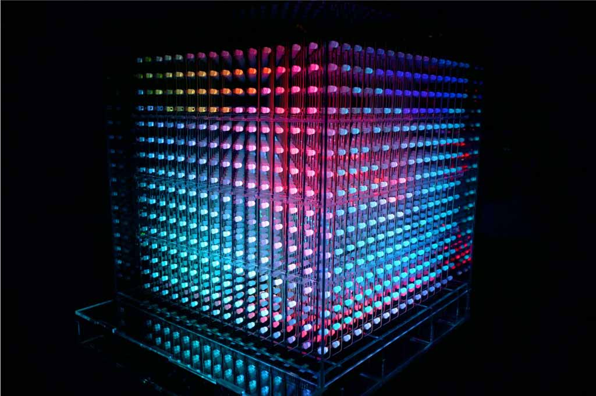

A code base for driving Omnivox, a custom built voxel LED display. Includes code for the node.js server, viewer client, controller client and the microcontroller code (Teensy).

## Deployment
- Run `npm install` to get all the required node packages.
- Run `npm run dev|prod` for dev or production mode (leave this running for the watch).
- In parallel, run `npm start` to run server.js in production, or `npm run start_dev` to use nodemon while running the server during development.
- Navigate to http://locahost:4000/controller and http://localhost:4000/viewer have fun!

## Hardware
- The USB-to-serial uses a FTDI chip, see OS-specific instructions / downloads here: https://ftdichip.com/document/installation-guides/

## Images

## Authors
- Quanta Collective ([@quantacollective](https://instagram.com/quantacollective))
- Team Leads: Callum Hay ([@callumhay](https://github.com/callumhay)) and Sara Vinten 
- Software and Hardware Design and Development: Callum Hay
- Prototyping and Physical Design: Sara Vinten and Callum Hay
- Modeling and Construction: Sara Vinten and Callum Hay
- Laser Cutting and CnC Assistance: Trish Lamanna
